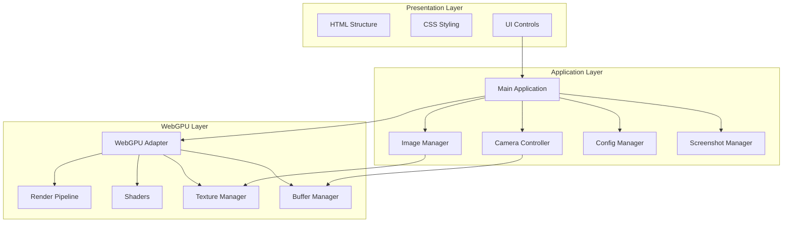
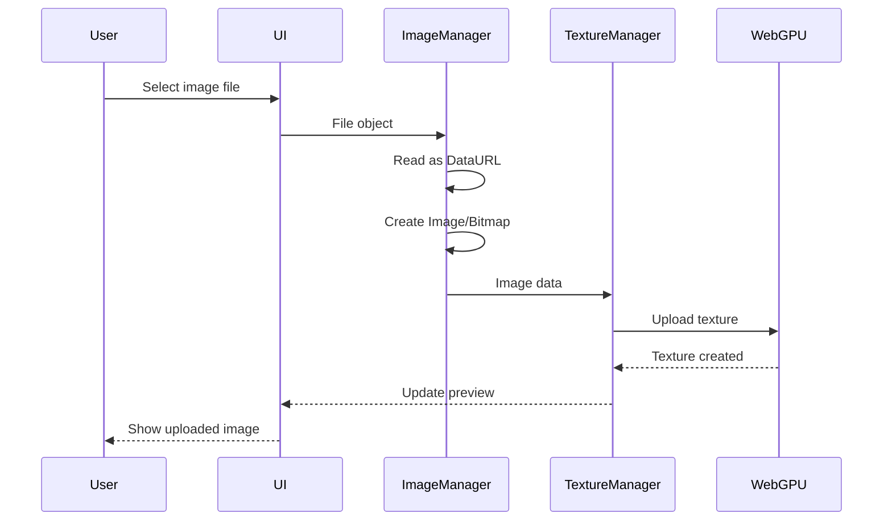
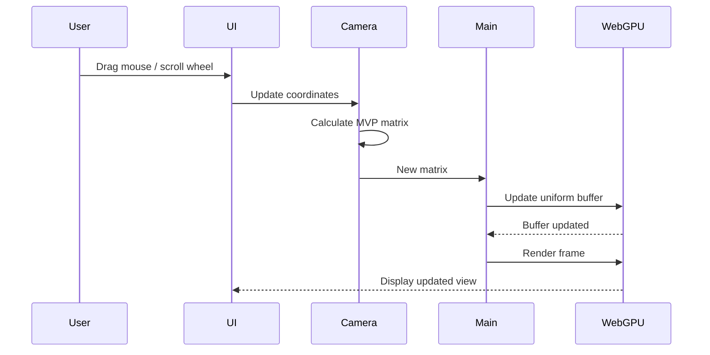
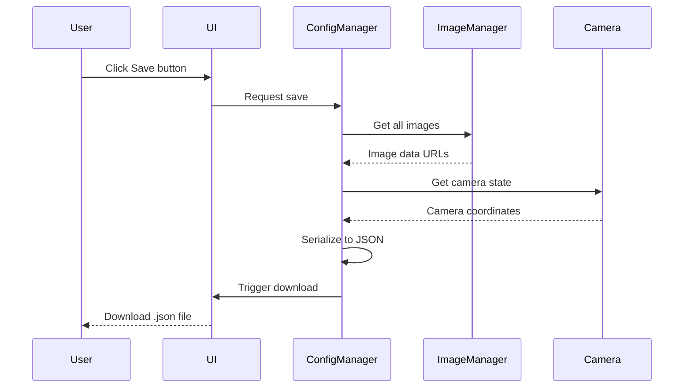

# Cover 3D - WebGPU Game Box Cover Viewer

## Table of Contents

1. [Project Overview](#project-overview)
2. [Technical Stack](#technical-stack)
3. [Architecture Overview](#architecture-overview)
4. [File Structure](#file-structure)
5. [Implementation Steps](#implementation-steps)
   - [Phase 1: Project Setup and WebGPU Initialization](#phase-1-project-setup-and-webgpu-initialization)
   - [Phase 2: 3D Cube Implementation](#phase-2-3d-cube-implementation)
   - [Phase 3: Camera Controls](#phase-3-camera-controls)
   - [Phase 4: Image Upload System](#phase-4-image-upload-system)
   - [Phase 5: Configuration Management](#phase-5-configuration-management)
   - [Phase 6: Screenshot Capture](#phase-6-screenshot-capture)
   - [Phase 7: UI Development](#phase-7-ui-development)
   - [Phase 8: Render Loop and Integration](#phase-8-render-loop-and-integration)
   - [Phase 9: Testing and Polish](#phase-9-testing-and-polish)
6. [Key Technical Decisions](#key-technical-decisions)
7. [Data Flow Diagrams](#data-flow-diagrams)
8. [Cube Face Mapping](#cube-face-mapping)
9. [MVP Matrix Calculation](#mvp-matrix-calculation)
10. [Browser Support](#browser-support)
11. [Security Considerations](#security-considerations)
12. [Future Enhancements](#future-enhancements)
13. [Success Criteria](#success-criteria)
14. [References](#references)

---

## Project Overview

This document outlines the implementation plan for a web-based 3D game box cover viewer. The application allows users to upload images for each face of a 3D cube and view them with interactive camera controls.

### Core Features

- **3D Rendering**: WebGPU-powered cube with 6 textured faces
- **Image Upload**: Upload custom images for each cube face
- **Camera Controls**: Rotate around cube and zoom in/out
- **Save/Load**: Export and import complete configuration
- **Screenshots**: Capture and download current view as transparent PNG

### Use Case

Game box cover viewer for viewing ROM/game box art in 3D, useful for game collectors, emulator users, and retro gaming enthusiasts.

---

## Technical Stack

| Technology | Purpose |
|------------|---------|
| **Plain JavaScript** | No frameworks, vanilla JS implementation |
| **WebGPU** | Modern 3D graphics API for rendering |
| **WGSL** | WebGPU Shading Language for shaders |
| **HTML5** | Semantic markup structure |
| **CSS3** | Styling and responsive layout |

---

## Architecture Overview



---

## File Structure

```
src/
├── index.html              # Main HTML structure
├── css/
│   └── style.css           # Application styles
├── js/
│   ├── main.js             # Application entry point
│   ├── webgpu/
│   │   ├── init.js         # WebGPU initialization
│   │   ├── shaders.js      # WGSL shader code
│   │   ├── pipeline.js     # Render pipeline setup
│   │   ├── textures.js     # Texture management
│   │   └── buffers.js      # Buffer management
│   ├── camera.js           # Camera controller
│   ├── cube.js             # Cube geometry and data
│   ├── imageManager.js     # Image upload and processing
│   ├── configManager.js    # Save/load configuration
│   └── screenshot.js       # Screenshot capture
├── assets/
│   └── placeholder.png     # Default texture placeholder
└── README.md               # Project documentation
```

---

## Implementation Steps

### ✅ Phase 1: Project Setup and WebGPU Initialization

#### ✅ 1.1 Create Project Structure

Create the directory structure as outlined in the [File Structure](#file-structure) section.

**Tasks:**
- Create all directories
- Create `index.html` with basic HTML5 boilerplate
- Create `css/style.css` with basic layout styles
- Create placeholder asset for default textures

#### ✅ 1.2 WebGPU Initialization (`js/webgpu/init.js`)

Initialize the WebGPU context and handle browser compatibility.

**Tasks:**
- Request WebGPU adapter from browser
- Request WebGPU device
- Configure swap chain for canvas
- Handle WebGPU compatibility checks
- Provide fallback/error messaging for unsupported browsers

**Key Functions:**
```javascript
async function initWebGPU(canvas) {
    // Check for WebGPU support
    if (!navigator.gpu) {
        throw new Error('WebGPU not supported');
    }
    
    // Get adapter and device
    const adapter = await navigator.gpu.requestAdapter();
    const device = await adapter.requestDevice();
    
    // Configure context
    const context = canvas.getContext('webgpu');
    const format = navigator.gpu.getPreferredCanvasFormat();
    
    context.configure({
        device,
        format,
        alphaMode: 'premultiplied'
    });
    
    return { device, context, format };
}
```

#### ✅ 1.3 Shader Development (`js/webgpu/shaders.js`)

Define WGSL shaders for vertex and fragment processing.

**Vertex Shader:**
- Define vertex attributes (position, UV coordinates)
- Apply model-view-projection matrix transformation
- Pass UV coordinates to fragment shader

**Fragment Shader:**
- Sample texture using UV coordinates
- Apply basic lighting (optional ambient/directional)
- Output final color

**WGSL Code Structure:**
```wgsl
// Vertex shader
struct VertexInput {
    @location(0) position: vec3<f32>,
    @location(1) uv: vec2<f32>
}

struct VertexOutput {
    @builtin(position) position: vec4<f32>,
    @location(0) uv: vec2<f32>
}

@vertex
fn vertexMain(input: VertexInput) -> VertexOutput {
    // Apply MVP matrix transformation
    // ...
}

// Fragment shader
@fragment
fn fragmentMain(@location(0) uv: vec2<f32>) -> @location(0) vec4<f32> {
    // Sample texture and output color
    // ...
}
```

#### ✅ 1.4 Render Pipeline Setup (`js/webgpu/pipeline.js`)

Create the render pipeline with proper configuration.

**Tasks:**
- Create vertex buffer layout descriptor
- Create pipeline layout (bind groups for uniforms and textures)
- Create render pipeline with shaders
- Configure primitive topology (triangle list)
- Configure depth/stencil state for proper 3D rendering

---

### ✅ Phase 2: 3D Cube Implementation

#### ✅ 2.1 Cube Geometry (`js/cube.js`)

Define the cube's vertices, indices, and UV coordinates.

**Tasks:**
- Define cube vertices (8 corners)
- Define vertex indices for 12 triangles (2 per face × 6 faces)
- Define UV coordinates for each vertex (map to 6 faces)
- Create vertex buffer with position and UV data
- Create index buffer

**Cube Data Structure:**
```javascript
const cubeVertices = [
    // Front face
    { position: [-1, -1,  1], uv: [0, 0] },
    { position: [ 1, -1,  1], uv: [1, 0] },
    { position: [ 1,  1,  1], uv: [1, 1] },
    { position: [-1,  1,  1], uv: [0, 1] },
    // ... other faces
];

const cubeIndices = [
    0, 1, 2, 0, 2, 3,  // Front
    // ... other faces
];
```

#### ✅ 2.2 Buffer Management (`js/webgpu/buffers.js`)

Manage GPU buffers for vertices, indices, and uniforms.

**Tasks:**
- Create and manage vertex buffers
- Create and manage index buffers
- Create uniform buffers for transformation matrices
- Implement buffer update methods

#### ✅ 2.3 Texture Management (`js/webgpu/textures.js`)

Handle texture creation and updates for cube faces.

**Tasks:**
- Create texture objects for each cube face (6 textures)
- Implement texture upload from Image/Bitmap objects
- Create sampler for texture filtering
- Manage bind groups for texture binding
- Handle texture updates when images change

---

### ✅ Phase 3: Camera Controls

#### ✅ 3.1 Camera Controller (`js/camera.js`)

Implement a spherical camera system for orbit controls.

**Tasks:**
- Implement spherical camera coordinates (radius, theta, phi)
- Create view matrix from camera position
- Create projection matrix (perspective)
- Combine into model-view-projection (MVP) matrix
- Handle camera state updates

**Camera State:**
```javascript
const camera = {
    radius: 5,      // Distance from cube
    theta: 0,       // Horizontal angle
    phi: Math.PI/3, // Vertical angle
    target: [0, 0, 0] // Look-at point
};
```

#### ✅ 3.2 User Input Handling

Implement mouse and touch controls for camera manipulation.

**Tasks:**
- **Mouse Drag:** Rotate camera around cube (update theta/phi)
- **Mouse Wheel:** Zoom in/out (update radius)
- **Touch Support:** Pinch to zoom, drag to rotate
- Implement smooth interpolation for camera movements

#### ✅ 3.3 Matrix Math Utilities

Implement or include matrix operations for 3D transformations.

**Required Operations:**
- Matrix multiplication
- Perspective projection matrix
- LookAt/view matrix
- Rotation matrices (X, Y, Z axes)

---

### ✅ Phase 4: Image Upload System

#### ✅ 4.1 Image Manager (`js/imageManager.js`)

Handle file uploads and image processing for cube faces.

**Tasks:**
- Create file input elements for each cube face (6 inputs)
- Handle file selection events
- Validate image formats (PNG, JPG, JPEG, WebP)
- Read files as Data URLs or ImageBitmap
- Store image references for each face

**Face Mapping:**
```javascript
const faces = {
    front: 0,
    back: 1,
    right: 2,
    left: 3,
    top: 4,
    bottom: 5
};
```

#### ✅ 4.2 Image Processing

Process uploaded images for WebGPU compatibility.

**Tasks:**
- Convert uploaded images to WebGPU-compatible format
- Handle non-square images (fit/cover options)
- Apply placeholder texture when no image uploaded
- Update WebGPU textures when images change

#### ✅ 4.3 UI for Image Upload

Create user interface for image uploads.

**Tasks:**
- Create 6 upload zones (one per cube face)
- Display current image preview for each face
- Show face labels (Front, Back, Left, Right, Top, Bottom)
- Add clear/remove button for each face

---

### ✅ Phase 5: Configuration Management

#### ✅ 5.1 Config Manager (`js/configManager.js`)

Manage saving and loading application state.

**Configuration Data Structure:**
```javascript
{
    camera: {
        radius: number,
        theta: number,
        phi: number
    }
}
```

#### ✅ 5.2 Save Configuration

Export current state to a JSON file.

**Tasks:**
- Serialize current state to JSON
- Download as `.json` file

#### ✅ 5.3 Load Configuration

Restore state from a JSON file.

**Tasks:**
- Read JSON file
- Parse and validate configuration
- Restore camera position
- Update UI to reflect loaded state

---

### ✅ Phase 6: Screenshot Capture

#### ✅ 6.1 Screenshot Manager (`js/screenshot.js`)

Implement screenshot functionality.

**Tasks:**
- Capture current canvas frame
- Convert to downloadable image format (transparent PNG)
- Provide filename with timestamp

#### ✅ 6.2 UI Integration

Add screenshot controls to the interface.

**Tasks:**
- Add screenshot button to toolbar
- Show success notification after capture
- Handle errors during capture

---

### ✅ Phase 7: UI Development

#### ✅ 7.1 Main Layout (`index.html`)

Create the HTML structure for the application.

**Layout Components:**
- Header with title and description
- Main canvas area for 3D rendering
- Sidebar or panel for controls:
  - Image upload section (6 faces)
  - Camera controls info
  - Action buttons (Save, Load, Screenshot)
- Footer with credits

#### ✅ 7.2 Styling (`css/style.css`)

Apply styling for a polished user experience.

**Styling Tasks:**
- Responsive layout (flexbox/grid)
- Dark theme for better 3D visualization
- Styled file inputs with drag-and-drop support
- Button styling with hover effects
- Loading states and error messages
- Mobile-friendly controls

#### ✅ 7.3 Main Application (`js/main.js`)

Coordinate all application modules.

**Tasks:**
- Initialize all modules
- Set up event listeners
- Handle application lifecycle
- Coordinate between modules
- Implement render loop

---

### ✅ Phase 8: Render Loop and Integration

#### ✅ 8.1 Render Loop (`js/main.js`)

Implement the main rendering loop.

**Tasks:**
- Implement `requestAnimationFrame` loop
- Update camera state
- Update uniform buffers
- Execute render pass
- Handle window resize

**Render Loop Structure:**
```javascript
function render() {
    // Update camera
    camera.update();
    
    // Update uniform buffers
    updateUniformBuffers();
    
    // Execute render pass
    const commandEncoder = device.createCommandEncoder();
    const passEncoder = commandEncoder.beginRenderPass(renderPassDescriptor);
    passEncoder.setPipeline(pipeline);
    passEncoder.setVertexBuffer(0, vertexBuffer);
    passEncoder.setIndexBuffer(indexBuffer, 'uint16');
    passEncoder.drawIndexed(numIndices);
    passEncoder.end();
    
    device.queue.submit([commandEncoder.finish()]);
    
    requestAnimationFrame(render);
}
```

#### ✅ 8.2 Error Handling

Implement comprehensive error handling.

**Error Scenarios:**
- WebGPU initialization failures
- Image upload errors
- Configuration load/save errors
- Screenshot capture errors
- Graceful degradation where possible

---

### ✅ Phase 9: Testing and Polish

#### ✅ 9.1 Browser Compatibility Testing

Test across different browsers and platforms.

**Testing Tasks:**
- Test on Chrome (WebGPU enabled)
- Test on Edge (WebGPU enabled)
- Test on Firefox (WebGPU support varies)
- Provide fallback message for unsupported browsers

#### ✅ 9.2 Performance Optimization

Optimize for smooth performance.

**Optimization Tasks:**
- Minimize texture uploads
- Use efficient buffer updates
- Optimize render loop
- Handle large images gracefully

#### ✅ 9.3 User Experience Polish

Refine the user experience.

**Polish Tasks:**
- Add loading indicators
- Provide helpful tooltips
- Add keyboard shortcuts
- Smooth animations
- Clear error messages

---

## Key Technical Decisions

### WebGPU vs WebGL

| Aspect | Decision | Rationale |
|--------|----------|-----------|
| API | WebGPU | Modern, efficient, future-proof |
| Fallback | Error message | Display message for unsupported browsers |

### Camera System

| Aspect | Decision | Rationale |
|--------|----------|-----------|
| Approach | Spherical coordinates | Intuitive orbit controls, easy to implement |
| Alternative | Quaternion-based rotation | More complex, not needed for MVP |

### Texture Management

| Aspect | Decision | Rationale |
|--------|----------|-----------|
| Approach | 6 separate textures | Simple mapping, independent face updates |
| Alternative | Texture atlas | Fewer draw calls but more complex |

### Image Storage

| Aspect | Decision | Rationale |
|--------|----------|-----------|
| Approach | Data URLs in JSON | Simple, self-contained files |
| Limitation | Large file sizes | Consider compression for high-res images |

---

## Data Flow Diagrams

### Image Upload Flow



### Camera Control Flow



### Configuration Save Flow



---

## Cube Face Mapping

```
        +Y (Top)
         |
         |
         |
         +-------- +X (Right)
        /|
       / |
      /  |
     /   |
    /    |
   +Z (Front)
```

| Face | UV Mapping | Normal Direction |
|------|------------|------------------|
| Front | (0, 0.5) to (0.33, 1) | +Z |
| Back | (0.66, 0.5) to (1, 1) | -Z |
| Right | (0.33, 0.5) to (0.66, 1) | +X |
| Left | (0, 0) to (0.33, 0.5) | -X |
| Top | (0.33, 0) to (0.66, 0.5) | +Y |
| Bottom | (0.66, 0) to (1, 0.5) | -Y |

---

## MVP Matrix Calculation

The Model-View-Projection (MVP) matrix is calculated as:

```
MVP = Projection × View × Model
```

### Matrix Components

| Matrix | Purpose |
|--------|---------|
| **Model Matrix** | Identity (cube at origin) |
| **View Matrix** | LookAt from camera position to origin |
| **Projection Matrix** | Perspective projection with FOV, aspect ratio, near/far planes |

### Camera Position Calculation

Camera position derived from spherical coordinates:

```
x = radius × sin(phi) × cos(theta)
y = radius × cos(phi)
z = radius × sin(phi) × sin(theta)
```

---

## Browser Support

| Browser | WebGPU Support | Notes |
|---------|----------------|-------|
| Chrome 113+ | ✅ Full | Default enabled |
| Edge 113+ | ✅ Full | Default enabled |
| Firefox | ⚠️ Partial | Requires flag `dom.webgpu.enabled` |
| Safari | ⚠️ Partial | Requires flag or newer version |

### Fallback Strategy

Display clear message with browser compatibility information and links to supported browsers.

---

## Security Considerations

### 1. Image Upload Validation

- Validate file types (MIME type check)
- Limit file size (e.g., 10MB per image)
- Sanitize filenames

### 2. Configuration Files

- Validate JSON structure before parsing
- Limit configuration file size
- Handle malformed JSON gracefully

### 3. XSS Prevention

- Use `textContent` instead of `innerHTML` for user content
- Sanitize any displayed filenames

---

## Future Enhancements

The following features are out of scope for the MVP but could be added later:

- [ ] Animation support (spinning cube)
- [ ] Multiple cube presets
- [ ] Lighting controls
- [ ] Background color/image options
- [ ] Export to 3D model formats (OBJ, GLTF)
- [ ] VR/AR support
- [ ] Cloud storage integration
- [ ] Social sharing features

---

## Success Criteria

The implementation is considered complete when:

1. ✅ WebGPU cube renders correctly with 6 faces
2. ✅ User can upload images for all 6 cube faces
3. ✅ Images display correctly as textures on the cube
4. ✅ Camera rotates around cube via mouse drag
5. ✅ Camera zooms in/out via mouse wheel
6. ✅ Configuration can be saved to JSON file
7. ✅ Configuration can be loaded from JSON file
8. ✅ Screenshots can be captured and downloaded
9. ✅ UI is responsive and user-friendly
10. ✅ Error handling is in place for all operations

---

## References

- [WebGPU Specification](https://www.w3.org/TR/webgpu/)
- [WebGPU API - MDN](https://developer.mozilla.org/en-US/docs/Web/API/WebGPU_API)
- [WGSL Shader Language](https://www.w3.org/TR/WGSL/)
- [3D Math Primer](https://gamemath.com/)