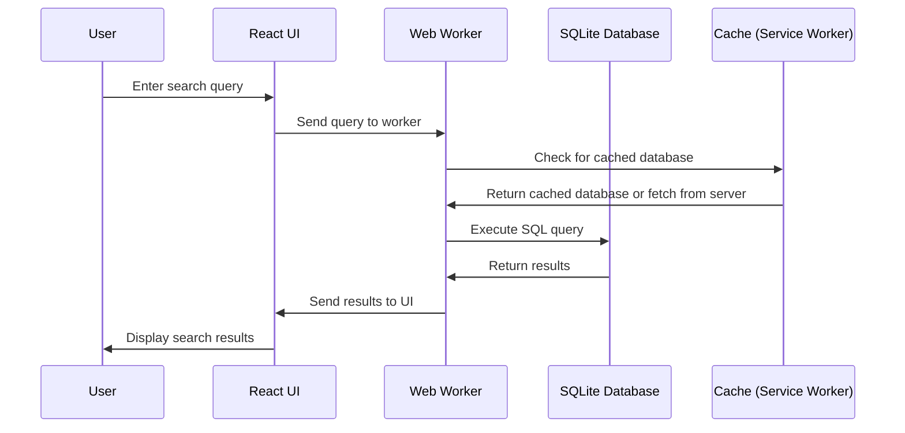

# ADR-004: SQLite as a Service Using sql.js

## Status

Accepted

**Date**: 2026-01-26

## Context

We need a database solution for storing and querying large ROM dataset information in our web application. The application must be able to:

1. Handle large datasets efficiently (multiple ROM sets with thousands of entries)
2. Perform complex queries with filtering and sorting
3. Work entirely in the browser without requiring a backend server
4. Be easy to maintain and update with new ROM set data
5. Support offline functionality

Key considerations:
- Data storage requirements for large CSV datasets
- Query performance for search operations
- Browser compatibility and performance
- Ease of data import and updates
- Offline accessibility

## Decision

We will use SQLite as the database engine, leveraging sql.js - a SQLite library compiled to WebAssembly - to run SQLite directly in the browser.

### Key Reasons for Choosing SQLite with sql.js

1. **Single-file database**: SQLite databases are self-contained in a single file, making them easy to distribute and update
2. **Powerful query language**: Full SQL support enables complex queries, joins, and filtering
3. **WebAssembly performance**: sql.js runs SQLite compiled to WebAssembly, providing near-native performance
4. **No backend required**: Database operations happen entirely in the browser
5. **Data import simplicity**: ROM set CSV files can be converted to SQLite databases offline
6. **Mature technology**: SQLite is a proven, stable database engine used by millions of applications
7. **Offline functionality**: Databases are cached locally in the browser for offline use

## Consequences

### Positive

- **High performance**: WebAssembly provides fast query execution even for large datasets
- **Full SQL support**: Complex queries with LIKE operations, sorting, and filtering
- **Easy data management**: Single-file databases are simple to version and distribute
- **Offline accessibility**: Database files are cached in the browser
- **No backend infrastructure**: Reduces deployment complexity and costs
- **Mature ecosystem**: Extensive documentation and community support

### Negative

- **Initial load time**: Database files can be large (10-100MB), increasing initial load time
- **Memory limitations**: Browser memory constraints may limit maximum dataset size
- **Concurrency**: Single-threaded nature of JavaScript may limit concurrent query performance
- **Data update complexity**: Updating database content requires generating new database files offline

### Neutral

- **Web Worker architecture**: Queries run in background web workers to avoid blocking the UI
- **File size optimization**: Database files are compressed and optimized for web delivery
- **Caching strategy**: Service workers can cache database files for repeated visits

## Alternatives Considered

### Alternative 1: Browser LocalStorage/SessionStorage

**Description**: Using the browser's built-in storage mechanisms.

- **Pros**: 
  - No external dependencies
  - Synchronous API (simple to use)
  - Small storage overhead
- **Cons**:
  - Limited storage capacity (usually 5-10MB)
  - No SQL query support
  - Not suitable for large datasets
  - Slow performance with large amounts of data

**Why rejected**: Storage limits and lack of query capabilities make this unsuitable for our large ROM dataset.

### Alternative 2: IndexedDB

**Description**: Browser's built-in NoSQL database.

- **Pros**:
  - Larger storage capacity (usually 50MB+ or unlimited with user permission)
  - Asynchronous API
  - Transaction support
- **Cons**:
  - No SQL query language
  - Complex API with steep learning curve
  - Limited query capabilities (basic key-value operations)
  - Performance degrade with complex queries

**Why rejected**: Lack of SQL support and complex API make it less maintainable than SQLite.

### Alternative 3: Remote Database with API

**Description**: Using a backend server with a database (e.g., PostgreSQL, MySQL) and REST API.

- **Pros**:
  - Unlimited storage capacity
  - Full SQL capabilities
  - Server-side processing
- **Cons**:
  - Requires backend infrastructure
  - Network latency for every query
  - No offline functionality
  - Increased deployment and maintenance complexity
  - Cost of hosting and maintaining backend services

**Why rejected**: Adds unnecessary complexity and eliminates offline functionality.

### Alternative 4: Other Client-Side Databases

**Description**: Libraries like LokiJS, Dexie.js, or PouchDB.

- **Pros**:
  - JavaScript-native APIs
  - No WebAssembly overhead
- **Cons**:
  - Limited query capabilities compared to SQLite
  - Smaller community and ecosystem
  - Less mature and battle-tested
  - Performance issues with very large datasets

**Why rejected**: SQLite's maturity, query capabilities, and performance make it a superior choice.

## Implementation Notes

### Key Files and Components

- **Database creation**: `db/init.ts` - Initializes SQLite database
- **Data import**: `db/seed.ts` - Imports CSV data into SQLite
- **Database operations**: `frontend/src/services/gameSearchService.ts` - Handles search queries
- **Web Worker**: `frontend/src/workers/worker.sql-wasm.ts` - Runs SQLite queries in background
- **ROM set converter**: `db/romset-converter/romset-converter.go` - Converts CSV to SQLite offline
- **Compiled ROM databases**: `frontend/public/db/*.db` - Pre-compiled SQLite database files

### Data Flow



### Query Strategy

Queries are executed using sql.js in a web worker to avoid blocking the UI:

```typescript
// Example query execution in web worker
import initSqlJs from 'sql.js';

const SQL = await initSqlJs({
  locateFile: (file) => `/wasm/${file}`
});

const response = await fetch('/db/MAME_v0.277.db');
const buffer = await response.arrayBuffer();
const db = new SQL.Database(new Uint8Array(buffer));

const results = db.exec('SELECT * FROM games WHERE name LIKE ?', ['%mario%']);
```

### Database Management

1. **Adding new ROM sets**: Convert CSV to SQLite using romset-converter.go
2. **Optimization**: Index frequently queried fields (name, year, manufacturer)
3. **Compression**: SQLite databases are compressed to reduce file size

## References

- **sql.js Documentation**: https://sql.js.org/
- **SQLite Documentation**: https://www.sqlite.org/
- **WebAssembly Guide**: https://webassembly.org/
- **Project ROM Set CSV Files**: `db/romsets/*.csv`
- **Related ADRs**: ADR-001 (TypeScript), ADR-002 (React Hooks)

## Notes

The decision to use SQLite with sql.js provides an excellent balance between performance, functionality, and simplicity. It allows us to provide a powerful search experience with complex query capabilities while maintaining a lightweight, offline-first architecture.

## For AI Agents

When implementing code related to this ADR:

1. **Always use SQL.js for database operations**: Avoid alternative storage mechanisms
2. **Execute queries in web workers**: Prevent UI blocking by running queries in background threads
3. **Pre-compile databases offline**: Convert CSV files to SQLite databases using romset-converter.go
4. **Optimize databases**: Add indexes to frequently queried fields
5. **Handle database loading**: Implement loading states and error handling for database operations
6. **Use SQL queries for data retrieval**: Leverage SQL's power for filtering, sorting, and searching
7. **Maintain consistency**: Keep database schemas consistent across different ROM set versions

When working with databases:

- Follow the data import process using the existing seed and init scripts
- Use transactions for multi-step operations
- Optimize queries to use indexes where possible
- Handle database errors gracefully
- Keep database files in the `frontend/public/db/` directory
- Update the `gameSearchService.ts` when adding support for new ROM sets
